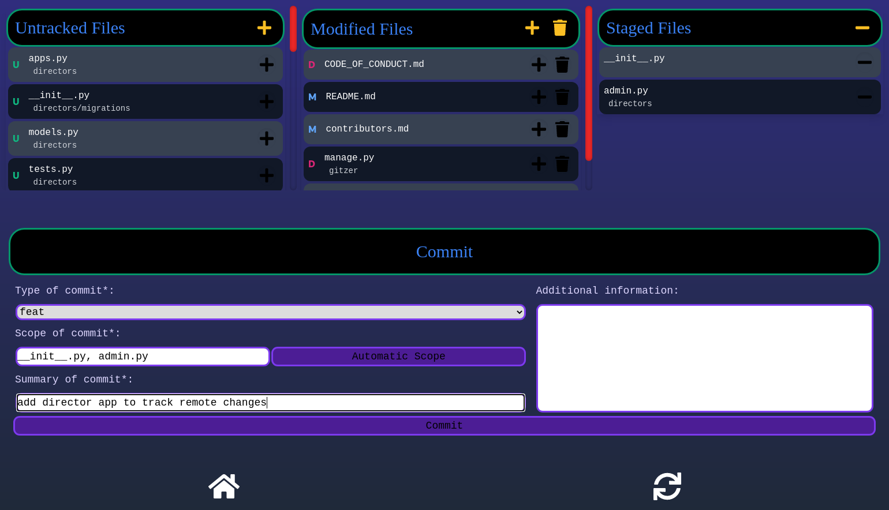

# Gitzer

Gitzer is a web based client for simple git operations. It allows you to stage,
unstage and commit your git changes. It uses the conventional commit
[specification](https://www.conventionalcommits.org/en/v1.0.0/) for its commit template.



## Summary

- [Gitzer](#gitzer)
  - [Summary](#summary)
    - [Prerequisites](#prerequisites)
    - [Installing](#installing)
    - [Uninstalling](#uninstalling)
  - [Using](#using)
  - [Built With](#built-with)
  - [Contributing](#contributing)
  - [Versioning](#versioning)
  - [Authors](#authors)
  - [License](#license)

### Prerequisites

You should have [Git](https://git-scm.com/) and [Python](https://www.python.org/)
installed on your system.

### Installing

Gitzer provides a custom installer that will install gitzer isolated from the
rest of your system by vendorizing its dependencies. This is the recommended
way of installing Gitzer.

```bash
curl -sSL https://raw.githubusercontent.com/IgnisDa/Gitzer/main/get-gitzer.py | python
```

### Uninstalling

Gitzer can be completely uninstalled from your system by running the `get-gitzer.py`
script with the `-u` flag.

```bash
curl -sSL https://raw.githubusercontent.com/IgnisDa/Gitzer/main/get-gitzer.py -o get-gitzer.py
python get-gitzer.py -u
```

## Using

To use gitzer, simply navigate to any directory which is a git repository and execute
`git gitzer` in it. A browser should open up with the correct URL. If it doesn't, copy
paste the URL in your browser and then use it. You can stop the server again
using _CTRL + C_ in the terminal.

## Built With

- [Django](https://www.djangoproject.com/) - Used for powering the backend
- [NuxtJs](https://nuxtjs.org/) - Used as frontend framework
- [GraphQL](https://graphql.org/) - Used to make API calls from frontend to backend
- [Araidne](https://ariadnegraphql.org/) - Used to process the API call in the backend
- [Tailwind CSS](https://graphql.org/) - CSS framework to style the website
- [Docusaurus](https://docusaurus.io/) - Used for generating the documentation

## Contributing

Please read [CONTRIBUTING.md](CONTRIBUTING.md) for details on our code
of conduct, and the process for submitting pull requests to us.

## Versioning

We use [SemVer](http://semver.org/) for versioning.

## Authors

- **Diptesh Choudhuri** - _Original author_ - [IgnisDa](https://github.com/IgnisDa)

## License

This project is licensed under the
[Apache-2.0](https://www.apache.org/licenses/LICENSE-2.0) - see the
[LICENSE.md](LICENSE.md) file for details
